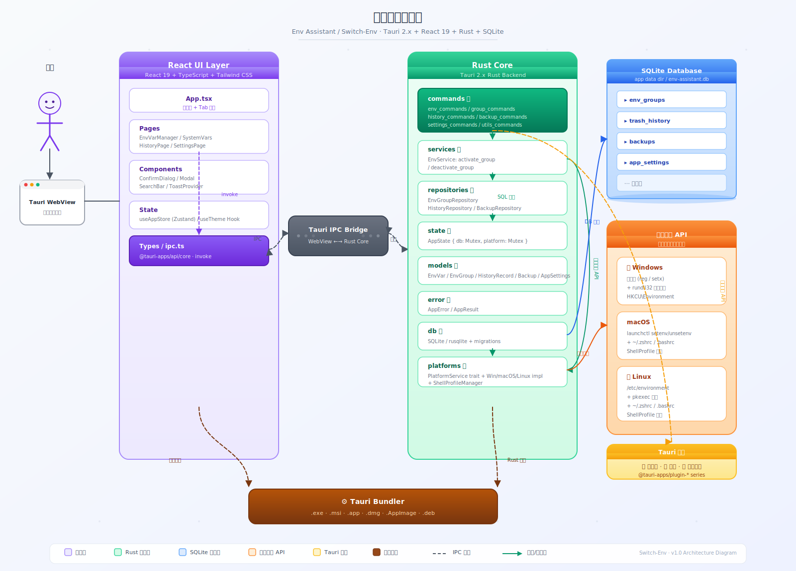
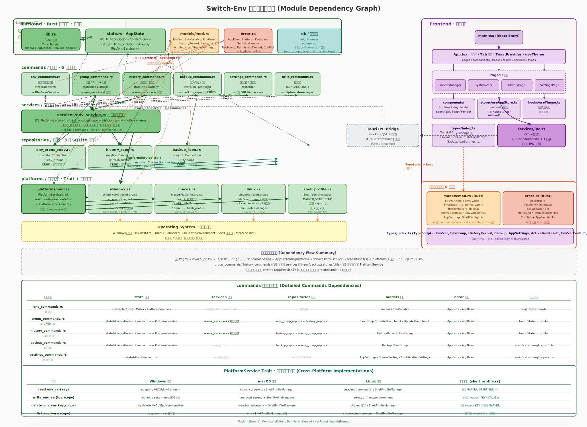
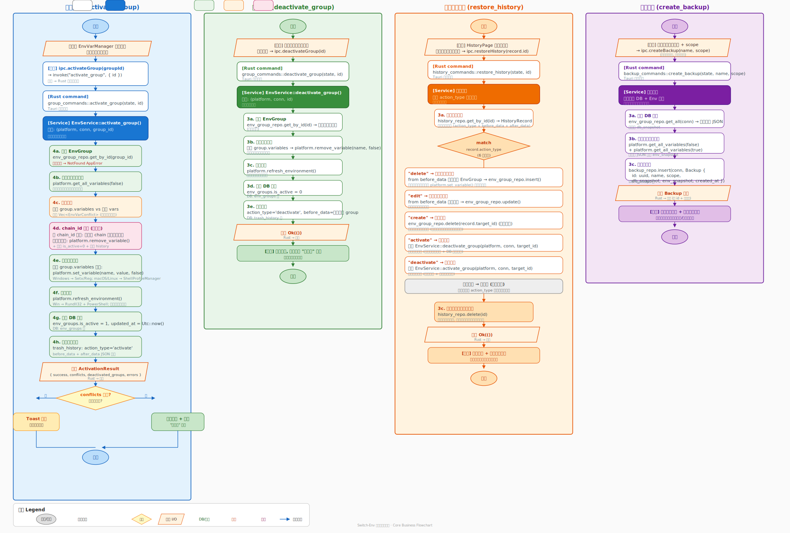

# Env Assistant（Switch-Env）详细设计方案 · v1

> **项目定位**：一款现代化、跨平台的桌面环境变量管理工具  
> **参考项目**：[Tianpei-Shi/Env_variable_assistant_utools](https://github.com/Tianpei-Shi/Env_variable_assistant_utools)（uTools 插件版，纯前端）  
> **本项目形态**：独立桌面应用（Tauri 2.x + React 19 + Rust）  
> **文档版本**：v1.0  
> **编写日期**：2026-06-10  
> **适用平台**：Windows 10/11 · macOS 12+ · Linux（主流发行版）

---

## 目录

<!-- TOC -->
1. [项目概述与设计目标](#1-项目概述与设计目标)
2. [技术选型与版本矩阵](#2-技术选型与版本矩阵)
3. [系统总体架构](#3-系统总体架构)
4. [分层架构设计](#4-分层架构设计)
5. [模块设计与依赖关系](#5-模块设计与依赖关系)
6. [核心业务流程](#6-核心业务流程)
7. [数据模型设计](#7-数据模型设计)
8. [数据库设计](#8-数据库设计)
9. [平台适配层设计](#9-平台适配层设计)
10. [前后端 IPC 接口设计](#10-前后端-ipc-接口设计)
11. [前端架构设计](#11-前端架构设计)
12. [错误处理与权限控制](#12-错误处理与权限控制)
13. [安全、隐私与数据位置](#13-安全隐私与数据位置)
14. [构建与部署](#14-构建与部署)
15. [测试策略](#15-测试策略)
16. [扩展规划（Roadmap）](#16-扩展规划roadmap)
17. [参考链接](#17-参考链接)
<!-- /TOC -->

---

## 1. 项目概述与设计目标

### 1.1 项目背景

原参考项目（`Env_variable_assistant_utools`）是一个基于 uTools 插件生态的**纯前端**环境变量管理工具，功能聚焦于：创建/编辑/删除环境变量组、一键激活/停用、系统变量查看、敏感值隐藏、复制到剪贴板。该实现依赖 uTools 插件 API，无法脱离 uTools 运行。

**Switch-Env（Env Assistant）** 在保留上述核心功能的基础上，重新实现为**独立跨平台桌面应用**，补齐以下能力：

| 能力维度 | uTools 版（参考项目） | Env Assistant（本项目） |
|---------|---------------------|----------------------|
| 运行形态 | uTools 插件内 | 独立桌面窗口（Tauri WebView） |
| 后端 | 浏览器环境，通过 uTools 插件 API 间接操作系统 | 原生 Rust 后端，直连操作系统 API |
| 数据存储 | localStorage / 浏览器存储 | 本地 SQLite 数据库（完整 CRUD + 事务） |
| 操作历史 | 无 | 自动记录 create/edit/delete/activate/deactivate 全操作，支持一键还原 |
| 备份/导入 | 无 | 支持 create_backup / export_backup / import_backup / restore_backup |
| 跨平台 | Windows（受限于 uTools） | Windows + macOS + Linux |
| 用户级/系统级 | 用户级为主，系统级需管理员启动 uTools | 双级支持，自动检测管理员权限（can_modify_system） |
| Shell 配置 | 无 | macOS/Linux 自动管理 `~/.zshrc` / `~/.bashrc` MARKER 区块 |
| 主题/通知 | 无 | 浅色/深色/跟随系统 + 桌面通知 + 应用内通知 |

### 1.2 顶层设计目标（Goals）

- **G1 — 易用性**：非开发者也能通过图形界面安全地管理环境变量，避免手写注册表或 `.bashrc`
- **G2 — 可还原性**：任何环境变量变更均可撤销（历史记录 + 备份），杜绝 "改崩 PATH"
- **G3 — 跨平台一致性**：三平台提供一致 API 与用户体验，平台差异隔离于 `platforms/` 目录
- **G4 — 零网络依赖**：纯本地运行，不收集也不上传任何数据
- **G5 — 轻量化**：二进制体积最小化（Tauri + Rust 对比 Electron 有数量级优势），启动时间 < 1s

### 1.3 非目标（Non-Goals）

- 不实现进程级环境变量注入（如 `direnv` 的 per-directory hook）
- 不实现远程同步 / 云备份（v2 可扩展，但 v1 保持本地）
- 不实现 Shell 脚本片段执行引擎
- 不实现系统级 Service / Daemon

### 1.4 关键用户故事

1. **用户 A（前端开发者）**：在 Node.js 18 与 Node.js 20 之间频繁切换 `PATH`，不希望每次都手动编辑系统环境变量
2. **用户 B（学生/初学者）**：跟随教程安装软件时被要求设置环境变量，但完全不知从何下手
3. **用户 C（运维）**：修改 `PATH` 后系统异常，希望能一键回滚到修改前的状态
4. **用户 D（多语言开发者）**：同时需要管理 JAVA_HOME / PYTHONPATH / GOPATH / ANDROID_HOME，希望以"组"为单位进行切换

---

## 2. 技术选型与版本矩阵

### 2.1 前端技术栈

| 技术 | 版本 | 用途 | 选择理由 |
|------|------|------|---------|
| React | 19.x | UI 框架 | 函数组件 + Hooks 生态成熟 |
| TypeScript | 5.6.x | 类型安全 | 与 Rust 后端 `#[derive(Serialize)]` 生成的 JSON 结构一一对应 |
| Vite | 6.x | 构建工具 | 开发热更新，生产构建输出至 `dist/`，Tauri 打包器直接引用 |
| Tailwind CSS | 3.4.x | 样式方案 | 原子化 CSS，配合 dark: 前缀实现深色模式 |
| Zustand | 5.x | 状态管理 | 轻量级，对比 Redux 显著减少模板代码，仅用于缓存 `AppSettings` |
| Lucide React | 0.469.x | 图标库 | 与 Tailwind 风格一致，体积小 |
| @dnd-kit/core | 6.3.x | 拖拽 | 为未来排序功能预留（v1 暂未在 UI 暴露） |
| @tauri-apps/api | 2.2.x | IPC 前端 API | `invoke()` 封装所有后端命令 |

### 2.2 后端技术栈

| 技术 | 版本 | 用途 | 选择理由 |
|------|------|------|---------|
| Rust | stable（MSRV 1.75+） | 后端实现语言 | 内存安全、零成本抽象、编译期类型安全 |
| Tauri | 2.x | 桌面应用框架 | WebView + Rust Core，包体积小、启动快 |
| rusqlite | 0.32 | SQLite 绑定 | 自带 bundled 模式，无需系统 SQLite |
| rusqlite_migration | 1.x | 数据库迁移 | `schema.sql` 首次运行时自动建表 |
| serde / serde_json | 1.x | 序列化/反序列化 | 与 TypeScript 类型自动对齐 |
| uuid | 1.x | ID 生成 | 所有主键使用 UUID v4 |
| chrono | 0.4 | 时间处理 | `Utc::now().timestamp()` 作为统一时间戳 |
| thiserror | 2.x | 错误类型派生 | 定义 `AppError` 枚举 |
| tokio | 1.x | 异步运行时 | 提供 `Mutex` 用于 `AppState` 的线程安全访问 |
| async-trait | 0.1 | 异步 trait | 为 `PlatformService` 提供 `async fn` |
| winreg | 0.52 | Windows 注册表 | Windows 平台读写环境变量（当前主要通过 `reg` / `setx`，已预留） |
| dirs | 6.x | 标准目录定位 | macOS/Linux 定位 `$HOME` / Shell 配置文件路径 |

### 2.3 版本依赖关系

```
Tauri 2.x ─┬─► tauri-plugin-shell
           ├─► tauri-plugin-dialog
           ├─► tauri-plugin-notification
           ├─► tauri-plugin-clipboard-manager
           └─► tauri-plugin-fs

React 19 ──► Vite 6 ──► Tailwind 3
              │
              └─► @tauri-apps/api 2.x
```

### 2.4 与参考项目的差异

参考项目（uTools 版）与本项目在技术栈上的关键差异：

| 维度 | uTools 版 | Env Assistant（本项目） |
|------|----------|-----------------------|
| 前端框架 | Vue（推测） | React 19 + TypeScript |
| 运行时 | Electron 内嵌浏览器（uTools） | Tauri WebView + Rust |
| 持久化 | localStorage | SQLite + JSON（backups/history 表） |
| 平台访问 | uTools 插件 API | Rust 直接调用系统命令（reg / setx / launchctl / pkexec 等） |
| 打包 | uTools 插件市场 | 原生安装包（.msi/.dmg/.deb/.AppImage） |

---

## 3. 系统总体架构

### 3.1 架构总览图



> 原始 drawio 文件：[drawio/01-system-architecture.drawio](./drawio/01-system-architecture.drawio)

### 3.2 架构说明

整个系统从左至右可以划分为 4 个大区：

**A. 前端表现区（React 19 + TypeScript + Tailwind CSS）**
- 运行于 Tauri WebView 内部，与普通 Web 应用一致
- 通过 `@tauri-apps/api/core` 的 `invoke()` 函数与 Rust 后端通信
- 状态管理：Zustand（全局） + React useState（页面级）
- 组件库：自封装（ConfirmDialog / Modal / SearchBar / ToastProvider）

**B. IPC 桥接层（Tauri IPC Bridge）**
- 由 Tauri 框架提供，前端调用 `invoke('命令名', 参数)` → Rust 侧 `#[tauri::command]` 函数执行
- 消息格式：JSON（由 serde + ts-rs 类型契约保证）
- 所有命令在 `lib.rs` 中通过 `tauri::generate_handler![...]` 一次性注册

**C. Rust 核心后端区**
- 按职责划分为 7 个子模块（commands / services / repositories / db / models / platforms / state + error）
- `AppState` 作为单例状态容器，内部用 `tokio::sync::Mutex` 包裹 SQLite 连接句柄与 PlatformService

**D. 外部系统区**
- **SQLite**：所有业务数据持久化（变量组、历史、备份、设置）
- **操作系统 API**：Windows 注册表、Windows setx/reg 命令、macOS launchctl、Linux /etc/environment + pkexec
- **Shell 配置文件**：`~/.zshrc` / `~/.bashrc`，通过 MARKER 标记区块读写
- **Tauri 插件**：剪贴板 / 通知 / 对话框 / 文件系统，在 Rust 命令中调用或前端调用

### 3.3 启动流程

```
tauri::Builder::default()
  │
  ├─► plugin(shell/dialog/notification/clipboard/fs) 初始化
  │
  ├─► manage(AppState::new())   注册全局状态（空占位）
  │
  ├─► invoke_handler            注册所有 Rust #[tauri::command] 函数
  │
  └─► setup(|app| {
        │
        ├─► let app_dir = app.path().app_data_dir()
        ├─► 打开 / 创建 env-assistant.db
        ├─► db::migrations::run_migrations()  建表（幂等）
        ├─► let platform = platforms::create_platform_service()
        └─► state.init(conn, platform)        将连接和平台服务放入 Mutex
      })
```

启动后用户点击窗口标签 → 前端 invoke() → 后端命令函数 → 业务逻辑 → 返回 JSON → 前端渲染更新。

---

## 4. 分层架构设计

### 4.1 分层架构图


> 原始 drawio 文件：[drawio/02-layered-architecture.drawio](./drawio/02-layered-architecture.drawio)

### 4.2 各层职责

#### Layer 1 — 表现层（Presentation Layer）

**文件位置**：`src/**/*`（React + TypeScript）

**职责**：
- 组件树渲染与事件监听
- 页面 Tab 切换（变量组 / 系统变量 / 历史记录 / 设置）
- 前端表单与输入校验（组名非空、变量名非空等）
- 应用状态（Zustand）：主题模式、通知偏好、历史保留策略
- 调用后端：通过 `services/ipc.ts` 的封装函数，语义化命名如 `getAllGroups()` / `activateGroup(id)`

**数据流向约束**：前端**绝不**直接操作数据库或系统 API，必须通过 IPC 调用 Rust 命令。

#### Layer 2 — IPC 通信层

**文件位置**：`src/services/ipc.ts`（前端） + `src-tauri/src/lib.rs`（后端注册）

**职责**：
- 前端 `invoke('命令名', params)` → Rust 侧匹配到具体 `#[tauri::command]` 函数
- 返回值统一为 `Result<T, AppError>`，Tauri 自动将错误序列化为字符串，前端通过 `try/catch` 捕获展示 Toast
- 命令与 ipc.ts 保持**一一对应**：前端一个函数 = 后端一个 `#[tauri::command]`

#### Layer 3 — 命令层（Command Layer）

**文件位置**：`src-tauri/src/commands/*.rs`（6 个模块）

**职责**：
- 作为 IPC 调用的第一落点，负责**参数反序列化**、**锁获取**、**调用下层**、**返回结果序列化**
- 不包含业务流程决策（如冲突检测、chain_id 处理等），这些下沉到 Service 层
- 直接操作 Repository 属于允许范围（简单 CRUD 无需 Service 包装）

| 模块 | 代表命令 | 说明 |
|------|---------|------|
| `env_commands.rs` | `get_all_env_vars(is_system)` / `set_env_var(name, value, is_system)` | 直接的单个环境变量读写（系统变量页面使用） |
| `group_commands.rs` | `create_group(name, desc, vars, chain_id)` / `activate_group(id)` | 变量组管理（核心业务） |
| `history_commands.rs` | `get_history()` / `restore_history(id)` / `clear_history()` | 历史记录浏览与回滚 |
| `backup_commands.rs` | `create_backup(name, scope)` / `export_backup(id, path)` | 备份/导出/导入 |
| `settings_commands.rs` | `get_app_settings()` / `set_app_settings(settings)` | 用户偏好持久化 |
| `utils_commands.rs` | `copy_to_clipboard(text)` | 系统剪贴板 |

#### Layer 4 — 业务服务层（Service Layer）

**文件位置**：`src-tauri/src/services/env_service.rs`

**职责**：
- 承载有状态、多步骤、涉及跨表/跨模块的业务流程
- 当前唯一 Service：`EnvService`，提供 `activate_group` 与 `deactivate_group`
- 内部流程包含：读库 → 冲突检测 → chain_id 互斥 → 批量调用平台 API → 写回状态 → 写入历史记录
- 新功能建议：若后续加入 "导入环境变量文件" / "变量组对比" 等复杂功能，应在此层新增函数或扩展新 Service

#### Layer 5 — 数据仓储层（Repository Layer）

**文件位置**：`src-tauri/src/repositories/{env_group_repo,history_repo,backup_repo}.rs`

**职责**：
- 数据库表的 CRUD 封装，每个 `.rs` 对应一张表（一对多关系的处理在调用方完成）
- 不暴露 SQLite 细节，函数签名以 `&Connection` 为入参，避免耦合到全局 AppState
- 使用 `rusqlite::params!` 宏防止 SQL 注入
- 返回 `rusqlite::Result<T>`，错误由上层统一映射到 `AppError::Database`

| Repository | 表 | 主要函数 |
|-----------|-----|---------|
| EnvGroupRepository | `env_groups` | get_all / get_by_id / insert / update / delete / get_active_by_chain |
| HistoryRepository | `trash_history` | get_all(target_type?, limit?) / get_by_id / insert / delete / clear_by_type |
| BackupRepository | `backups` | get_all / get_by_id / insert / delete |

#### Layer 6 — 平台适配层（Platform Layer）

**文件位置**：`src-tauri/src/platforms/{mod,windows,macos,linux,shell_profile}.rs`

**职责**：
- 定义 `PlatformService` async trait，规范 6 个核心操作：`get_all_variables / set_variable / remove_variable / get_variable / can_modify_system / refresh_environment / open_system_settings / get_shell_config_info` + `get_value_length_limit / get_platform_info`
- 每个平台独立实现该 trait，平台差异完全隔离
- `ShellProfileManager` 是 macOS/Linux 共享的子模块，负责在 `~/.zshrc` / `~/.bashrc` 中以 MARKER 方式写入/删除 `export KEY="VALUE"` 行

**关键设计**：平台工厂函数 `create_platform_service()` 通过条件编译 `cfg(target_os = "...")` 返回正确实现，调用方无需感知平台。

#### Layer 7 — 基础设施层（Infrastructure Layer）

**文件位置**：`src-tauri/src/{state,error,db}/*` + Tauri 插件

**职责**：
- `state.rs`：`AppState { db: Mutex<Option<Connection>>, platform: Mutex<Option<Box<dyn PlatformService>>> }`，作为 `tauri::State<'_, AppState>` 在所有命令中共享
- `db/`：SQLite 连接管理 + `schema.sql` 迁移脚本，首次启动自动建表
- `error.rs`：`AppError` 统一错误类型 + `AppResult<T>` 类型别名
- Tauri Plugins：跨平台的剪贴板/通知/对话框/文件系统访问

### 4.3 数据流约束（依赖倒置原则）

- 上层依赖下层（Presentation → IPC → Command → Service → Repository → DB/Platform）
- 下层绝不反向依赖上层（Repository 中**不会**出现 PlatformService 相关代码）
- 所有跨平台逻辑通过 `PlatformService` trait 抽象，不出现 `cfg(target_os)` 外溢到 Service/Command 层
- 数据库连接不暴露到前端，不直接执行前端传入的 SQL

---

## 5. 模块设计与依赖关系

### 5.1 模块依赖图



> 原始 drawio 文件：[drawio/03-module-dependency.drawio](./drawio/03-module-dependency.drawio)

### 5.2 依赖总览

```
前端（TypeScript）                       Rust 后端
────────────────────                    ────────────────────
main.tsx                                lib.rs (Tauri Builder 入口)
  │                                       │
  ▼                                       ▼
App.tsx ─┬─► pages/*                 commands/* (6 modules)
         ├─► components/*                │
         ├─► stores/useAppStore.ts       ├─► state.rs
         ├─► hooks/useTheme.ts           ├─► services/env_service.rs
         └─► services/ipc.ts ──────IPC───┤
                                         ├─► repositories/* (3 modules)
types/index.ts ─────(类型契约)───────────► models/mod.rs
                                         ├─► db/migrations.rs
前端所有模块共用 types/index.ts 接口      ├─► platforms/*
                                          ├─► error.rs
                                          └─► Tauri plugins (clipboard/notification/...)
```

### 5.3 关键模块说明

#### 5.3.1 `lib.rs` — 应用入口

- 负责：**模块声明**（`mod commands; mod db; ...`）、**插件注册**、**状态管理注册**、**命令注册**、**setup 闭包**（数据库打开 + 迁移 + 平台服务实例化）
- 设计要点：setup 闭包中的 `state.init(conn, platform)` 是唯一向 Mutex 写入真实值的位置，之后所有命令只可读不可替换
- 平台服务实例化：`create_platform_service()` 使用 `cfg(target_os)` 选择实现，这是编译期绑定

#### 5.3.2 `state.rs` — 全局状态

```rust
pub struct AppState {
    pub db: Mutex<Option<Connection>>,
    pub platform: Mutex<Option<Box<dyn PlatformService>>>,
}
```

- 为什么使用 `tokio::sync::Mutex`？因为 `#[tauri::command]` 是 `async fn`，需要一个可在 `.await` 间持有的同步原语
- 为什么使用 `Option`？因为 `Builder::default().manage(AppState::new())` 需要一个可以构造的零值，之后在 setup 中写入真实对象
- 每个命令函数签名模式：`state: State<'_, AppState>` → `let db = state.db.lock().await; let conn = db.as_ref().unwrap();`

#### 5.3.3 `models/mod.rs` — 数据契约

- Rust 侧所有 `#[derive(Serialize, Deserialize, Clone, Debug)]` 的结构体
- 对应 TypeScript 侧 `types/index.ts` 的 `interface` 定义
- 这是**跨语言类型契约**，修改时必须**两端同步更新**
- 建议做法：修改 Rust 结构体后搜索前端对应名称做全局更新（或在 v2 引入 ts-rs 代码生成）

#### 5.3.4 `platforms/` — 跨平台抽象

```rust
#[async_trait]
pub trait PlatformService: Send + Sync {
    async fn get_all_variables(&self, is_system_scope: bool) -> Result<Vec<EnvVar>, PlatformError>;
    async fn set_variable(&self, name: &str, value: &str, is_system_scope: bool) -> Result<(), PlatformError>;
    async fn remove_variable(&self, name: &str, is_system_scope: bool) -> Result<(), PlatformError>;
    async fn get_variable(&self, name: &str) -> Result<Option<String>, PlatformError>;
    async fn can_modify_system(&self) -> Result<bool, PlatformError>;
    async fn refresh_environment(&self) -> Result<(), PlatformError>;
    fn get_value_length_limit(&self) -> usize;
    async fn open_system_settings(&self) -> Result<(), PlatformError>;
    async fn get_shell_config_info(&self) -> Result<ShellConfigInfo, PlatformError>;
    fn get_platform_info(&self) -> PlatformInfo;
}
```

- `async_trait` 宏让我们可以在 trait 中使用 `async fn`（Rust 稳定版原生尚不支持 async trait）
- `Send + Sync` bounds 是为了满足 `Mutex<Option<Box<dyn PlatformService>>>` 的线程安全要求
- 三平台实现差异在第 9 节详细说明

#### 5.3.5 `db/schema.sql` — 数据库 Schema

由 `rusqlite_migration::Migrations` 执行，首次启动时建表，后续启动幂等（表已存在则跳过）。详细表结构见第 8 节。

### 5.4 依赖约束清单（设计约束）

| 约束 | 说明 | 违规识别方式 |
|-----|------|------------|
| 命令层不得直接调用 `std::process::Command` | 系统调用只能在 `platforms/` | 代码搜索 `Command::new` 出现位置仅限 platforms/ |
| 前端 TypeScript 接口名 = Rust 结构体字段名（snake_case ↔ camelCase 通过 serde rename） | `#[serde(rename = "isActive")]` 统一处理 | 字段映射在 models 中集中定义，不要散落在各处 |
| 数据库操作只能出现在 `repositories/` 和 `db/` | `rusqlite` 只能在这两层 import | 代码搜索 `use rusqlite` 不应出现在其他文件 |
| 所有修改操作（activate/deactivate/create/edit/delete）必须写入历史记录 | 调用 `HistoryRepository::insert` 的时机覆盖所有状态变更 | 可在 Code Review 阶段 check |
| `AppError` 必须实现 `Serialize` 以正确返回前端 | 当前通过手动实现 `serialize` 方法序列化到字符串 | 新增错误分支后要确保前端能正确 catch |

---

## 6. 核心业务流程

### 6.1 核心业务流程图



> 原始 drawio 文件：[drawio/04-core-business-flow.drawio](./drawio/04-core-business-flow.drawio)

### 6.2 流程一：激活变量组（activate_group）

**触发点**：用户在 "变量组管理" 页面点击某个未激活组左侧的电源图标。

**完整调用链**：

```
[前端 EnvVarManager.tsx]
    │
    ├─► ipc.activateGroup(groupId)
    │       └─► invoke("activate_group", { id })
    │                 │
    ▼                 ▼
[Rust: group_commands::activate_group(state, id)]
    │
    ├─► state.db.lock().await        获取 DB 连接锁
    ├─► state.platform.lock().await  获取 PlatformService 锁
    │
    └─► EnvService::activate_group(platform, conn, &id)
              │
              ├─► 1) env_group_repo::get_by_id(id)
              │        └─► 若 None → AppError::NotFound
              │
              ├─► 2) platform.get_all_variables(false)
              │        └─► 获取当前用户级环境变量快照
              │
              ├─► 3) 冲突检测：
              │        for var in group.variables {
              │          if existing_vars 中存在同名且值不同 {
              │            push to Vec<EnvVarConflict>
              │          }
              │        }
              │
              ├─► 4) chain_id 互斥处理：
              │        if let Some(chain_id) = group.chain_id {
              │          let others = env_group_repo::get_active_by_chain(chain_id)
              │          for other in others {
              │            platform.remove_variable(other.variables...)     // 清理其他组
              │            env_group_repo::update(other { is_active: 0 })  // 标记停用
              │            history_repo::insert(HistoryRecord {
              │              action_type: "deactivate", ...
              │            })
              │          }
              │        }
              │
              ├─► 5) platform.set_variable(name, value, false)  for 组内每个变量
              │        └─► Windows: setx / reg add
              │            macOS:   ShellProfileManager.set_var()
              │            Linux:   ShellProfileManager.set_var()
              │
              ├─► 6) platform.refresh_environment()
              │        └─► Windows: rundll32.exe user32.dll,UpdatePerUserSystemParameters
              │                       + PowerShell 发一条 set env 再撤回触发广播
              │            macOS/Linux: (空操作，新 shell 自动生效)
              │
              ├─► 7) env_group_repo::update(group { is_active: 1, updated_at: now })
              │
              ├─► 8) history_repo::insert(HistoryRecord {
              │          action_type: "activate",
              │          before_data: Some(serde_json::to_string(&original_group)?),
              │          after_data: Some(serde_json::to_string(&activated_group)?),
              │          timestamp: now,
              │        })
              │
              └─► 返回 ActivationResult { success, conflicts, deactivated_groups, errors }

[前端 EnvVarManager.tsx]
    │
    ├─► 若 conflicts 非空：Toast 警告 "发现 X 个变量冲突"
    ├─► 若 errors 非空：Toast 错误 "部分变量设置失败"
    └─► 成功：重新拉取 getAllGroups() → UI 刷新为绿色"已激活"
```

**幂等性**：对一个已激活的组重复调用 `activate_group` 当前会**重复执行**（v1 已知，v2 可优化为跳过）。

### 6.3 流程二：停用变量组（deactivate_group）

```
[前端] ipc.deactivateGroup(id)
    │
    ▼
[Rust: group_commands::deactivate_group(state, id)]
    │
    └─► EnvService::deactivate_group(platform, conn, id)
              │
              ├─► 1) env_group_repo::get_by_id(id)
              │        └─► 若 None 或 is_active=0 → 直接 Ok(())（接近幂等）
              │
              ├─► 2) for var in group.variables {
              │        platform.remove_variable(name, false)
              │      }
              │
              ├─► 3) platform.refresh_environment()
              │
              ├─► 4) env_group_repo::update(group { is_active: 0, updated_at: now })
              │
              └─► 5) history_repo::insert(HistoryRecord {
                        action_type: "deactivate",
                        before_data: Some(serialized_group),
                        after_data: None,
                        timestamp: now,
                     })
```

### 6.4 流程三：历史记录还原（restore_history）

```
[前端 HistoryPage.tsx] 用户点击记录右侧还原图标
    │
    └─► ipc.restoreHistory(record.id)
              │
              ▼
[Rust: history_commands::restore_history(state, id)]
    │
    ├─► history_repo::get_by_id(id) → HistoryRecord
    │
    └─► match record.action_type.as_str() {

          // 删除操作回滚：反序列 before_data 写回 DB + 重新写系统变量
          "delete" => {
            let group: EnvGroup = serde_json::from_str(&record.before_data?)
            env_group_repo::insert(conn, &group)
            for var in group.variables { platform.set_variable(...) }
          }

          // 编辑回滚：before_data 即为操作前的状态
          "edit" => {
            let group: EnvGroup = serde_json::from_str(&record.before_data?)
            env_group_repo::update(conn, &group)
          }

          // 创建回滚：直接删除该组
          "create" => {
            env_group_repo::delete(conn, &record.target_id)
          }

          // 激活回滚 → 等价于停用
          "activate" => EnvService::deactivate_group(...)

          // 停用回滚 → 等价于激活
          "deactivate" => EnvService::activate_group(...)

          _ => { /* 忽略未知类型 */ }
        }

    └─► history_repo::delete(conn, id)
        └─► 成功还原后移除该历史条目，防止重复还原
```

**设计要点**：`before_data` 是完整对象 JSON 快照（而非 diff），这带来几个影响：
- 优点：还原逻辑简单可靠，不需要应用补丁
- 缺点：历史记录表体积会增大（每个 EnvGroup 完整序列化一次）
- v1 决策：**接受这个缺点**，因为环境变量组数通常 < 100，且有 `retention_days` 限制
- v2 可考虑：改用 JSON patch 存储变更 diff

### 6.5 流程四：创建备份（create_backup）

```
[前端] （当前页面暂未暴露该功能，Rust 命令已实现）
    │
    └─► ipc.createBackup(name, scope)
              │
              ▼
[Rust: backup_commands::create_backup(state, name, scope)]
    │
    ├─► 1) env_group_repo::get_all(conn) → Vec<EnvGroup>
    │        └─► serde_json::json!({ "groups": groups }).to_string() → db_snapshot
    │
    ├─► 2) platform.get_all_variables(false) + platform.get_all_variables(true)
    │        └─► 合并 → JSON { user_vars, system_vars } → env_snapshot
    │
    ├─► 3) backup_repo::insert(conn, Backup {
    │          id: uuid_v4,
    │          name,
    │          scope,                // 预留（"full" / "groups" / "system-vars"）
    │          db_snapshot,
    │          env_snapshot,
    │          created_at: now,
    │       })
    │
    └─► 返回 Backup 对象
```

配套流程：`export_backup(id, path)` → 读取 backups 表记录，写成独立 JSON 文件 → 用户可跨设备迁移。`import_backup(path)` → 反向读取 + 写回 backups 表。`restore_backup(id)` → 用 `db_snapshot` 覆盖当前 env_groups（先全删再重建，简单粗暴，v2 可改为三方对比）。

---

## 7. 数据模型设计

### 7.1 Rust 数据模型

**文件位置**：`src-tauri/src/models/mod.rs`

| 结构体 | 用途 | 关键字段 |
|-------|-----|---------|
| `EnvVar` | 系统环境变量（读取结果） | name, value, is_system, is_readonly |
| `EnvVariable` | 组内变量（用户定义） | name, value, is_hidden |
| `EnvGroup` | 变量组（核心实体） | id, name, description, variables(Vec), is_active, chain_id(Option), created_at, updated_at |
| `CreateGroupInput` | 创建请求参数 | name, description, variables, chain_id |
| `UpdateGroupInput` | 更新请求参数 | name(Option), description(Option), variables(Option), chain_id(Option<Option>) |
| `ActivationResult` | 激活结果（含冲突警告） | success, conflicts(Vec<EnvVarConflict>), deactivated_groups(Vec<String>), errors(Vec<String>) |
| `EnvVarConflict` | 冲突信息 | name, existing_value, new_value |
| `ShellConfigInfo` | Shell 配置信息 | shell_path, config_file, managed_vars(Vec<String>) |
| `HistoryRecord` | 操作历史 | id, action_type, target_type, target_id, before_data(Option<String>), after_data(Option<String>), timestamp |
| `Backup` | 备份记录 | id, name, scope, db_snapshot, env_snapshot, created_at |
| `AppSettings` | 用户设置 | theme(ThemeSettings), notification(NotificationSettings), history(HistorySettings) |
| `ThemeSettings` | 主题 | mode("light"/"dark"/"system"), font_level(i32) |
| `NotificationSettings` | 通知 | desktop_enabled, in_app_enabled |
| `HistorySettings` | 历史保留 | auto_cleanup(bool), retention_days(i32) |

### 7.2 TypeScript 类型契约

**文件位置**：`src/types/index.ts`

```typescript
export interface EnvVar {
  name: string;
  value: string;
  isSystem: boolean;
  isReadonly: boolean;
}

export interface EnvVariable {
  name: string;
  value: string;
  isHidden: boolean;
}

export interface EnvGroup {
  id: string;
  name: string;
  description: string;
  variables: EnvVariable[];
  isActive: boolean;
  chainId: string | null;
  createdAt: number;
  updatedAt: number;
}

export interface ActivationResult {
  success: boolean;
  conflicts: EnvVarConflict[];
  deactivatedGroups: string[];
  errors: string[];
}

export interface EnvVarConflict {
  name: string;
  existingValue: string;
  newValue: string;
}

export interface HistoryRecord {
  id: string;
  actionType: string;      // 'create' | 'edit' | 'delete' | 'activate' | 'deactivate'
  targetType: string;      // 'group' （目前唯一类型，v2 可扩展）
  targetId: string;
  beforeData: string | null;
  afterData: string | null;
  timestamp: number;
}

export interface Backup {
  id: string;
  name: string;
  scope: string;
  dbSnapshot: string;       // JSON 字符串: { groups: EnvGroup[] }
  envSnapshot: string;      // JSON 字符串: { user_vars: EnvVar[], system_vars: EnvVar[] }
  createdAt: number;
}

export interface AppSettings {
  theme: { mode: string; fontLevel: number };
  notification: { desktopEnabled: boolean; inAppEnabled: boolean };
  history: { autoCleanup: boolean; retentionDays: number };
}

export interface ShellConfigInfo {
  shellPath: string;
  configFile: string;
  managedVars: string[];
}
```

### 7.3 字段命名策略

- **Rust 侧**：使用 snake_case（符合 Rust 惯例），通过 `#[serde(rename = "camelCase")]` 或 `#[serde(rename_all = "camelCase")]` 在跨 IPC 时转换
- **TypeScript 侧**：使用 camelCase（符合 JS/TS 惯例）
- **数据库列**：snake_case（与 SQLite 惯例一致）
- 三段命名通过 `serde rename` / `rusqlite row.get()` 人工绑定，目前无自动代码生成

---

## 8. 数据库设计

### 8.1 Schema 总览

**文件位置**：`src-tauri/src/db/schema.sql`

```
┌─────────────────────────────────────────────────────┐
│ TABLE env_groups                                     │
├─────────────────────────────────────────────────────┤
│ id            TEXT    PRIMARY KEY                    │
│ name          TEXT    NOT NULL                       │
│ description   TEXT    NOT NULL DEFAULT ''            │
│ variables     TEXT    NOT NULL  (JSON array string)  │
│ is_active     INTEGER NOT NULL DEFAULT 0             │
│ chain_id      TEXT                                   │
│ created_at    INTEGER NOT NULL                       │
│ updated_at    INTEGER NOT NULL                       │
└─────────────────────────────────────────────────────┘
        │ INDEX idx_env_groups_chain(chain_id)
        │ INDEX idx_env_groups_active(is_active)
        ▼
┌─────────────────────────────────────────────────────┐
│ TABLE trash_history                                  │
├─────────────────────────────────────────────────────┤
│ id            TEXT    PRIMARY KEY                    │
│ action_type   TEXT    NOT NULL                       │
│ target_type   TEXT    NOT NULL                       │
│ target_id     TEXT    NOT NULL                       │
│ before_data   TEXT              (JSON or NULL)       │
│ after_data    TEXT              (JSON or NULL)       │
│ timestamp     INTEGER NOT NULL                       │
└─────────────────────────────────────────────────────┘
        │ INDEX idx_trash_history_type(target_type)
        │ INDEX idx_trash_history_timestamp(timestamp)
        ▼
┌─────────────────────────────────────────────────────┐
│ TABLE backups                                        │
├─────────────────────────────────────────────────────┤
│ id            TEXT    PRIMARY KEY                    │
│ name          TEXT    NOT NULL                       │
│ scope         TEXT    NOT NULL                       │
│ db_snapshot   TEXT    NOT NULL                       │
│ env_snapshot  TEXT    NOT NULL                       │
│ created_at    INTEGER NOT NULL                       │
└─────────────────────────────────────────────────────┘

┌─────────────────────────────────────────────────────┐
│ TABLE app_settings                                   │
├─────────────────────────────────────────────────────┤
│ key           TEXT    PRIMARY KEY                    │
│ value         TEXT    NOT NULL                       │
│ updated_at    INTEGER NOT NULL                       │
└─────────────────────────────────────────────────────┘
  └─ 键值对存储。目前仅使用 key='app-settings'，value 为 JSON 字符串
```

### 8.2 表详细说明

#### 表 1 — env_groups（变量组主表）

| 列 | 类型 | 约束 | 含义 |
|---|------|------|-----|
| id | TEXT | PK | UUID v4 |
| name | TEXT | NOT NULL | 组显示名称 |
| description | TEXT | NOT NULL DEFAULT '' | 描述（中文备注） |
| variables | TEXT | NOT NULL | 变量数组序列化为 JSON 字符串，如 `[{"name":"JAVA_HOME","value":"/path","isHidden":false}]` |
| is_active | INTEGER | NOT NULL DEFAULT 0 | 0=未激活 / 1=已激活（SQLite 无原生 bool） |
| chain_id | TEXT | NULLABLE | 互斥链标识：同 chain_id 的组在同一时间只能有一个处于 active 状态 |
| created_at / updated_at | INTEGER | NOT NULL | Unix 秒级时间戳（chrono::Utc::now().timestamp()） |

**索引**：
- `idx_env_groups_chain(chain_id)` — 加速 `get_active_by_chain()`
- `idx_env_groups_active(is_active)` — 快速筛选激活状态（v1 在 UI 中未直接使用，v2 可为"仅显示已激活"过滤）

#### 表 2 — trash_history（操作历史）

设计灵感来自**事件溯源（Event Sourcing）** 的简化版：我们不为每条记录保存 diff，而是保存操作前完整对象（before_data）+ 操作后完整对象（after_data）。

| 列 | 类型 | 约束 | 含义 |
|---|------|------|-----|
| id | TEXT | PK | UUID v4 |
| action_type | TEXT | NOT NULL | `create` / `edit` / `delete` / `activate` / `deactivate` |
| target_type | TEXT | NOT NULL | `group`（v1 仅支持变量组操作历史，v2 可扩展为 `system-var` 等） |
| target_id | TEXT | NOT NULL | 被操作对象的主键 ID |
| before_data | TEXT | NULLABLE | 操作前的对象 JSON 字符串（对 create 操作为 NULL） |
| after_data | TEXT | NULLABLE | 操作后的对象 JSON 字符串（对 delete 操作为 NULL） |
| timestamp | INTEGER | NOT NULL | 操作时间 |

**索引**：
- `idx_trash_history_type(target_type)` — 按类型筛选
- `idx_trash_history_timestamp(timestamp)` — 默认按时间倒序展示

**自动清理**：在 `settings.history.auto_cleanup = true` 时，前端可定期调用清理（v1 中定时任务已预留，具体调度建议由前端 `useEffect` 触发 Rust 命令执行 DELETE WHERE timestamp < now - retention_days*86400；当前 v1 暂未开启自动调度，而是在进入历史页面时惰性检查）。

#### 表 3 — backups（备份）

| 列 | 类型 | 约束 | 含义 |
|---|------|------|-----|
| id | TEXT | PK | UUID v4 |
| name | TEXT | NOT NULL | 备份名称（用户自定义，如 "重装系统前"） |
| scope | TEXT | NOT NULL | 预留扩展字段：`"full"` / `"groups-only"` 等 |
| db_snapshot | TEXT | NOT NULL | `{ "groups": [EnvGroup...] }` JSON 字符串 |
| env_snapshot | TEXT | NOT NULL | `{ "user_vars": [...], "system_vars": [...] }` JSON 字符串 |
| created_at | INTEGER | NOT NULL | 备份时间 |

**v2 可扩展**：将 backups 表拆分出 `backup_items` 关联表，实现增量/差异备份。

#### 表 4 — app_settings（应用设置）

key-value 存储，便于向后扩展：

| key | value（JSON 示例） |
|-----|------------------|
| `app-settings` | `{"theme":{"mode":"dark","fontLevel":2},"notification":{"desktopEnabled":true,"inAppEnabled":true},"history":{"autoCleanup":true,"retentionDays":30}}` |

**为什么用 key-value 而不是多列？** 设置字段频繁变更，key-value 可以在**不修改数据库 schema** 的情况下添加新设置项（schema 迁移成本低）。

### 8.3 迁移机制

```rust
// db/migrations.rs
pub fn get_migrations() -> Migrations<'static> {
    Migrations::new(vec![
        M::up(include_str!("schema.sql")),
        // v2 新增字段：在这里追加 M::up("ALTER TABLE env_groups ADD COLUMN ...")
    ])
}

// lib.rs setup 中：
db::migrations::run_migrations(&conn).expect("failed to run migrations");
```

- `rusqlite_migration` 维护一个内部 `__migrations` 表记录已执行版本
- 应用升级时**只需新增 `M::up(...)` 条目**，框架自动识别并执行未应用过的迁移
- 迁移是**幂等且不可逆**的（设计为向前兼容）
- **严禁修改已提交的迁移脚本**（否则 `__migrations` 表记录 hash 对不上，启动失败）

### 8.4 数据位置

- **Windows**：`%APPDATA%\env-assistant\env-assistant.db`  
  例：`C:\Users\John\AppData\Roaming\env-assistant\env-assistant.db`
- **macOS**：`~/Library/Application Support/env-assistant/env-assistant.db`
- **Linux**：`~/.config/env-assistant/env-assistant.db` 或受 `XDG_CONFIG_HOME` 影响的路径

数据库文件是**纯 SQLite 格式**，可用任意 SQLite 客户端（如 `sqlite3` CLI、DB Browser for SQLite）直接打开查看。

---

## 9. 平台适配层设计

### 9.1 三平台对比矩阵

| 维度 | Windows | macOS | Linux |
|-----|---------|-------|-------|
| 用户级变量持久化 | `setx` 命令 → 注册表 `HKCU\Environment` | `~/.zshrc` 或 `~/.bashrc` 的 MARKER 区块 | `~/.zshrc` 或 `~/.bashrc` 的 MARKER 区块 |
| 用户级变量读取 | `reg query "HKCU\Environment"` | 读取 shell 配置文件 MARKER 段 + 当前环境变量 | 读取 shell 配置文件 MARKER 段 + 当前环境变量 |
| 系统级变量持久化 | `reg add "HKLM\SYSTEM\CurrentControlSet\Control\Session Manager\Environment"` / `setx /M` | `launchctl setenv`（GUI 进程） + shell 配置文件 | 写入 `/etc/environment`，通过 `pkexec` 提权 |
| 系统级变量读取 | `reg query "HKLM\SYSTEM\..."` | `env` / `launchctl getenv` | `/etc/environment` 文件读取 |
| 环境刷新 | `SendMessageTimeout(HWND_BROADCAST, WM_SETTINGCHANGE)` → 已封装为 rundll32 + PowerShell 触发 | 依赖新打开的 shell 自动 source | 依赖新打开的 shell 自动 source |
| 修改系统变量的权限检测 | `net session` 成功返回 = 有管理员权限 | `id -u` 为 0 = root | `id -u` 为 0 = root |
| 变量值长度限制 | `setx` 1024 字符限制，超长自动用 `reg add` | 无硬限制 | 无硬限制 |
| 打开系统设置 | `rundll32 sysdm.cpl,EditEnvironmentVariables` | 打开安全设置面板（未提供原生编辑器） | `xdg-open environment://`（各发行版支持不同） |

### 9.2 关键实现细节

#### 9.2.1 Windows 平台（`platforms/windows.rs`）

**写入用户变量**：
```
setx <NAME> "<VALUE>"
```
当 value 长度 > 1024 时（`setx` 的限制），回退到：
```
reg add "HKCU\Environment" /v <NAME> /t REG_SZ /d "<VALUE>" /f
```

**写入系统变量**（需管理员权限）：
```
reg add "HKLM\SYSTEM\CurrentControlSet\Control\Session Manager\Environment"
        /v <NAME> /t REG_SZ /d "<VALUE>" /f
```

**删除变量**：
```
reg delete "HKCU\Environment" /v <NAME> /f
```

**刷新环境**：`rundll32.exe user32.dll,UpdatePerUserSystemParameters` 会触发 `WM_SETTINGCHANGE` 广播，使已打开的资源管理器、新启动的进程能读到最新变量。但**已打开的 cmd/PowerShell 终端需要重启**才能生效。

**权限检测**：`net session` 命令在非管理员权限下执行会失败（返回非 0），在管理员权限下成功。这是一种轻量且无副作用的检测方式（对比 "创建测试文件到 C:\Windows" 的方式更干净）。

#### 9.2.2 macOS 平台（`platforms/macos.rs`）

**核心思路**：环境变量管理在 macOS 上分为两个场景：
- **GUI 应用进程**（如 IDE、浏览器）：通过 `launchctl setenv` 使其生效（对新启动的应用）
- **Shell 会话**（Terminal / iTerm2）：通过 `~/.zshrc` 或 `~/.bashrc` 中的 `export` 语句生效

本项目**侧重 Shell 会话**，采用 ShellProfileManager 的 MARKER 方案管理（因为开发人员主要在终端使用环境变量），同时也支持 launchctl（系统级 scope）。

#### 9.2.3 Linux 平台（`platforms/linux.rs`）

与 macOS 类似，但系统级变量通过 `/etc/environment` 文件管理：
- 读取：直接解析文件内容（`NAME="VALUE"` 格式）
- 写入：通过 `pkexec /bin/bash -c "echo NAME=\"VALUE\" >> /etc/environment"`（会弹出桌面环境的 polkit 认证对话框）
- 删除：`sed -i '/^NAME=/d' /etc/environment`

#### 9.2.4 ShellProfileManager（`platforms/shell_profile.rs`）

**核心机制**：在用户 Shell 配置文件中**不污染已有配置**，将所有 "本工具管理的变量" 写入一个**带标记的区块**：

```bash
# （用户原有的 .zshrc 内容）

# === Env Assistant START ===
export JAVA_HOME="/Library/Java/JavaVirtualMachines/jdk-21.jdk/Contents/Home"
export PATH="$JAVA_HOME/bin:$PATH"
# === Env Assistant END ===
```

**设计要点**：
1. 启动时根据 `SHELL` 环境变量判断 shell 类型（`zsh` → `~/.zshrc`，否则默认 `~/.bashrc`）
2. `set_var(name, value)`：
   - 若文件中不存在 MARKER：在末尾追加两行 MARKER 和一行 `export`
   - 若已存在 MARKER：在 MARKER 区间内查找 `NAME=` 开头的行，替换为新值；未找到则在 END 前插入新行
3. `remove_var(name)`：仅在 MARKER 区间内操作，**绝不触碰区间外的用户自定义内容**
4. `read_managed_vars()`：只解析 MARKER 区间内的 `export NAME="VALUE"` 行

**安全性**：如果用户手动删除了 MARKER 标记，我们的代码会判断为"无管理变量"，不会误删其他内容。这是一种"宽松解析、保守修改"的设计。

---

## 10. 前后端 IPC 接口设计

### 10.1 IPC 调用总表

| 前端调用（`src/services/ipc.ts`） | 对应 Rust 命令 | 功能 |
|-------------------------------|----------------|-----|
| `getAllEnvVars(isSystem)` | `env_commands::get_all_env_vars` | 获取系统/用户环境变量列表 |
| `getEnvVar(name)` | `env_commands::get_env_var` | 获取单个变量 |
| `setEnvVar(name, value, isSystem)` | `env_commands::set_env_var` | 设置单个变量 |
| `removeEnvVar(name, isSystem)` | `env_commands::remove_env_var` | 删除单个变量 |
| `canModifySystem()` | `env_commands::can_modify_system` | 检测系统级变量修改权限 |
| `refreshEnvironment()` | `env_commands::refresh_environment` | 触发系统环境广播刷新 |
| `openSystemSettings()` | `env_commands::open_system_settings` | 打开系统原生环境变量编辑器 |
| `getShellConfigInfo()` | `env_commands::get_shell_config_info` | 获取 Shell 配置文件位置与已管理变量 |
| `getAllGroups()` | `group_commands::get_all_groups` | 获取所有变量组 |
| `createGroup(name, desc, vars, chainId)` | `group_commands::create_group` | 创建变量组 |
| `updateGroup(id, ...)` | `group_commands::update_group` | 更新变量组 |
| `deleteGroup(id)` | `group_commands::delete_group` | 删除变量组（自动停用并写入历史） |
| `activateGroup(id)` | `group_commands::activate_group` | 激活变量组（核心业务） |
| `deactivateGroup(id)` | `group_commands::deactivate_group` | 停用变量组 |
| `getHistory(targetType?, limit?)` | `history_commands::get_history` | 列出操作历史 |
| `restoreHistory(id)` | `history_commands::restore_history` | 还原指定操作 |
| `clearHistory()` | `history_commands::clear_history` | 清空所有历史记录 |
| `createBackup(name, scope)` | `backup_commands::create_backup` | 创建本地备份 |
| `getAllBackups()` | `backup_commands::get_all_backups` | 列出本地备份 |
| `restoreBackup(id)` | `backup_commands::restore_backup` | 从备份还原（覆盖当前 env_groups） |
| `deleteBackup(id)` | `backup_commands::delete_backup` | 删除备份 |
| `exportBackup(id, path)` | `backup_commands::export_backup` | 导出备份到独立 JSON 文件 |
| `importBackup(path)` | `backup_commands::import_backup` | 导入 JSON 备份文件 |
| `getAppSettings()` | `settings_commands::get_app_settings` | 读取用户设置 |
| `setAppSettings(settings)` | `settings_commands::set_app_settings` | 保存用户设置 |
| `copyToClipboard(text)` | `utils_commands::copy_to_clipboard` | 复制到系统剪贴板 |

### 10.2 命令注册清单

在 `lib.rs` 中：

```rust
invoke_handler(tauri::generate_handler![
    // env
    commands::env_commands::get_all_env_vars,
    commands::env_commands::get_env_var,
    commands::env_commands::set_env_var,
    commands::env_commands::remove_env_var,
    commands::env_commands::can_modify_system,
    commands::env_commands::refresh_environment,
    commands::env_commands::open_system_settings,
    commands::env_commands::get_shell_config_info,
    // groups
    commands::group_commands::get_all_groups,
    commands::group_commands::create_group,
    commands::group_commands::update_group,
    commands::group_commands::delete_group,
    commands::group_commands::activate_group,
    commands::group_commands::deactivate_group,
    // history
    commands::history_commands::get_history,
    commands::history_commands::restore_history,
    commands::history_commands::clear_history,
    // backups
    commands::backup_commands::create_backup,
    commands::backup_commands::get_all_backups,
    commands::backup_commands::restore_backup,
    commands::backup_commands::delete_backup,
    commands::backup_commands::export_backup,
    commands::backup_commands::import_backup,
    // settings
    commands::settings_commands::get_app_settings,
    commands::settings_commands::set_app_settings,
    // utils
    commands::utils_commands::copy_to_clipboard,
])
```

### 10.3 错误返回约定

- 所有 Rust 命令返回类型为 `AppResult<T>`，即 `Result<T, AppError>`
- `AppError` 手动实现 `Serialize`：`self.to_string()` 作为错误消息（简单字符串）
- 前端通过 `try { await invoke(...) } catch (e) { showToast(String(e), 'error') }` 统一展示
- Rust 侧的变体：
  - `Platform(String)`：平台命令执行失败
  - `Database(rusqlite::Error)`：SQL 执行失败
  - `Serialization(serde_json::Error)`：JSON 序列化失败（通常是数据结构 bug）
  - `Io(std::io::Error)`：文件 IO 失败（如 shell 配置文件不可写）
  - `NotFound(String)`：指定 ID 找不到（如 delete 不存在的 group）
  - `PermissionDenied(String)`：缺少管理员/root 权限
  - `Conflict(String)`：预留，v1 暂未直接使用（冲突在 ActivationResult 中体现）

### 10.4 前端 ipc.ts 封装示例

```typescript
// 环境变量相关
export async function getAllEnvVars(isSystem: boolean): Promise<EnvVar[]> {
  return invoke('get_all_env_vars', { isSystem });
}

export async function setEnvVar(name: string, value: string, isSystem: boolean): Promise<void> {
  return invoke('set_env_var', { name, value, isSystem });
}

// 变量组相关
export async function activateGroup(id: string): Promise<ActivationResult> {
  return invoke('activate_group', { id });
}
```

**设计要点**：前端每个函数 = 后端一个 `#[tauri::command]`，命名尽量保持一致（前端 camelCase vs 后端 snake_case 的差距由 invoke 字符串参数桥接）。

---

## 11. 前端架构设计

### 11.1 目录结构

```
src/
├── components/                 通用组件（可在所有页面复用）
│   ├── ConfirmDialog.tsx       确认对话框（用于删除/清空等危险操作）
│   ├── Modal.tsx               通用模态框（带标题/内容/按钮栏的包装器）
│   ├── SearchBar.tsx           搜索栏（带防抖，用于过滤列表）
│   └── ToastProvider.tsx       全局通知（Context + Hook 模式）
├── pages/                      四大功能页面
│   ├── EnvVarManager.tsx       变量组管理（创建/编辑/删除/激活/停用/搜索）
│   ├── SystemVars.tsx          系统变量查看（用户级/系统级只读+搜索）
│   ├── HistoryPage.tsx         操作历史（列表/还原/清空）
│   └── SettingsPage.tsx        设置（主题/通知/历史保留）
├── services/
│   └── ipc.ts                  前后端通信封装（invoke() 的一层薄封装）
├── stores/
│   └── useAppStore.ts          Zustand 全局状态（AppSettings + 加载状态）
├── hooks/
│   └── useTheme.ts             主题 Hook（读写 class="dark" 到 <html>）
├── types/
│   └── index.ts                TypeScript 全局接口（与 Rust models 对齐）
├── App.tsx                     应用根组件（Tab 切换 + 主题 + Toast）
├── main.tsx                    ReactDOM.createRoot 入口
└── index.css                   Tailwind @tailwind base/components/utilities
```

### 11.2 根组件 App.tsx

```
App
├── ToastProvider (提供全局 showToast 能力)
└── <div className="min-h-screen bg-gray-50 dark:bg-gray-900 ...">
     ├── Header + 页面 Tab
     │      ├── 变量组（Layers 图标）
     │      ├── 系统变量（Monitor 图标）
     │      ├── 历史记录（History 图标）
     │      └── 设置（Settings 图标）
     └── Main
            ├── EnvVarManager  （active tab = 'groups'）
            ├── SystemVars      （active tab = 'system-vars'）
            ├── HistoryPage     （active tab = 'history'）
            └── SettingsPage    （active tab = 'settings'）
```

**主题切换**：`useTheme()` 在应用启动时从 `getAppSettings()` 读取 `theme.mode`，为 `<html>` 根元素添加/移除 `dark` 类，Tailwind 的 `dark:` 前缀类自动生效。

### 11.3 关键页面 — EnvVarManager（变量组管理）

**核心状态**：
- `groups: EnvGroup[]`：从后端拉取的所有组
- `loading: boolean`：加载状态（显示"加载中…"骨架）
- `search: string`：搜索关键词，对 name/description 做 `toLowerCase().includes()` 过滤
- `expandedId: string | null`：展开某组显示变量列表
- `showCreateModal: boolean`：控制"新建分组"模态框
- `deleteId: string | null`：控制"确认删除"对话框

**关键交互**：
1. 首次挂载 & 用户刷新 → `fetchGroups()` → `ipc.getAllGroups()`
2. 点击电源图标 → 判断当前 is_active → 调用 `activateGroup(id)` 或 `deactivateGroup(id)` → Toast 通知 → 重新拉取
3. 点击垃圾桶 → 弹出 `ConfirmDialog` → 确认后 `deleteGroup(id)` → 重新拉取
4. 点击复制 → 调用 `copyToClipboard()`（前端直接调，无需后端）

### 11.4 关键页面 — SystemVars（系统变量）

**设计要点**：
- 同时展示用户级与系统级两套列表，使用搜索栏联合过滤
- 启动时并行调用：
  ```typescript
  const [uVars, sVars, modify] = await Promise.all([
    ipc.getAllEnvVars(false),
    ipc.getAllEnvVars(true),
    ipc.canModifySystem(),
  ]);
  ```
- 无管理员权限时，顶部显示黄色警告条："当前无管理员权限，系统级变量为只读模式"
- 提供"打开系统设置"按钮（跳转系统原生编辑器）

### 11.5 状态管理策略（Zustand + useState 双层）

**useAppStore.ts（全局，跨页面共享）**：
- `settings: AppSettings`：用户偏好（主题/通知/历史保留）
- `updateSettings()`：本地修改 + 调用 `ipc.setAppSettings()` 持久化
- 设计理由：设置信息在 SettingsPage 修改，但 App.tsx 读取主题、HistoryPage 读取保留策略，跨页面共享需要全局状态

**页面级 useState（局部）**：
- 列表数据、搜索条件、模态框开关等页面局部状态
- 设计理由：这些状态生命周期与页面一致，无需进入全局 store，避免不必要的全局订阅

---

## 12. 错误处理与权限控制

### 12.1 错误传播链

```
PlatformError  (platforms/*)
       │ into()
       ▼
AppError::Platform  (error.rs)
       │ 实现 Serialize → to_string()
       ▼
前端 catch → showToast(errMsg, 'error')

rusqlite::Error  (repositories/*)
       │ into()
       ▼
AppError::Database
       ▼
前端同上

serde_json::Error / std::io::Error
       │ into()
       ▼
AppError::Serialization / AppError::Io
       ▼
前端同上
```

**设计要点**：通过 `thiserror` 派生的 `#[error("...")]` 属性，所有 `AppError` 变体都能生成**中文可读**消息（如 `#[error("平台错误: {0}")]`），前端无需再做消息映射，直接展示给用户即可。

### 12.2 系统级变量权限检测

- **Windows**：尝试执行 `net session`，成功（exit code 0）= 具备管理员权限
- **macOS/Linux**：检查 `id -u` 是否为 0（root）
- 结果在前端通过 `ipc.canModifySystem()` 获取，用于在 UI 展示警告/隐藏系统级操作按钮

**设计原则**：
- 权限检测是**预检**，不是安全边界（攻击者可以绕过 UI）
- 真正的权限控制在平台层 `set_variable(is_system_scope=true)` 时由操作系统强制执行（写入 HKLM / /etc/environment 时直接失败）
- Rust 层对失败进行捕获并包装为 `PlatformError::PermissionDenied`，最终以 Toast 形式展示给用户

### 12.3 典型错误场景

| 场景 | 前端表现 | 后端行为 |
|-----|---------|---------|
| 删除不存在的 group ID | Toast "变量组不存在" | `get_by_id()` 返回 None → `AppError::NotFound` |
| 在无管理员模式下尝试修改系统变量 | Toast "权限不足" | platform 层返回 `PlatformError::PermissionDenied` |
| `setx` 因字符集问题失败 | Toast "平台错误: ...（详细错误文本）" | `Command::new("setx").output()` 的 stderr 原样返回 |
| shell 配置文件不可写 | Toast "IO 错误: Permission denied" | `std::fs::write()` 返回 `io::Error` |
| JSON 序列化失败 | Toast "序列化错误: ..."（一般不出现，代表程序 bug） | `serde_json::to_string()` 失败时的 fallback |

### 12.4 并发与竞争

- **SQLite 连接**：被 `tokio::sync::Mutex` 包裹，任何时刻只有一个命令函数持有连接的可变引用。天然串行化，**不存在并发写竞争**
- **环境变量操作**：多个 activate_group 并行执行会互相覆盖。目前前端 UI 没有并行触发的设计（点击按钮后进入 loading，刷新完成后才可再次点击）
- **外部竞争**：其他程序/用户手动修改环境变量会导致 `EnvGroup.variables` 中的值与系统实际值不一致。v1 不主动检测这种漂移，v2 可增加 "健康检查 / 重新对齐" 功能

---

## 13. 安全、隐私与数据位置

### 13.1 隐私承诺

- **零网络请求**：应用不向任何服务器发起请求，无遥测、无崩溃上报（v1 默认）
- **无云端存储**：所有数据保存在本地 SQLite 数据库
- **无 cookie / localStorage 用于业务数据**：浏览器存储仅被 WebView 作为技术运行时使用

### 13.2 敏感信息处理

- `EnvVariable.isHidden = true` 的变量在 UI 中显示为 `••••••••`，但在数据库中**仍然是明文**（因为需要原样写回系统）
- **已知限制**：如果担心 "本机其他管理员可读取数据库文件"，建议不要在变量组中存储密码/Token 等高敏感信息，或使用操作系统的 Credential Manager（v2 可扩展接入 Windows Credential Locker / macOS Keychain / Linux libsecret）

### 13.3 文件系统权限边界

- 仅读写 `app_data_dir()`（Tauri 提供的标准应用数据目录）、用户 Shell 配置文件（`~/.zshrc` / `~/.bashrc`）和用户指定的备份导出路径
- 不扫描用户目录，不创建隐藏文件，不修改系统关键配置
- Windows 下使用 `setx` / `reg`，其权限由 Windows 自身 ACL 管理

### 13.4 SQL 注入防护

- 所有 SQL 操作使用 `rusqlite::params![...]` 宏做参数绑定，不存在字符串拼接 SQL 的情况
- Repository 层完全不接收外部传入的表名/列名作为动态参数
- 示例：`conn.execute("UPDATE env_groups SET name = ?1 WHERE id = ?2", params![group.name, group.id])`

---

## 14. 构建与部署

### 14.1 配置文件

**文件位置**：`src-tauri/tauri.conf.json`

```jsonc
{
  "$schema": "https://raw.githubusercontent.com/tauri-apps/tauri/dev/crates/tauri-cli/schema.json",
  "productName": "Env Assistant",
  "version": "1.0.0",
  "identifier": "com.env-assistant.app",
  "build": {
    "beforeDevCommand": "npm run dev",
    "devUrl": "http://localhost:1420",
    "beforeBuildCommand": "npm run build",
    "frontendDist": "../dist"
  },
  "app": {
    "windows": [
      { "title": "Env Assistant - 环境变量助手",
        "width": 1100, "height": 750, "minWidth": 800, "minHeight": 600,
        "resizable": true }
    ]
  },
  "bundle": {
    "active": true,
    "targets": "all",
    "icon": [ "icons/32x32.png", "icons/128x128.png", "icons/128x128@2x.png", "icons/icon.icns", "icons/icon.ico" ]
  }
}
```

### 14.2 开发模式

```bash
# 1. 安装 Node 依赖
npm install

# 2. 启动 Tauri 开发模式
npm run tauri dev
```

说明：`tauri dev` 内部会：
1. 执行 `beforeDevCommand`（即 `npm run dev`）— 启动 Vite 开发服务器，默认监听 `http://localhost:1420`
2. 编译 Rust 代码（`cargo build`，首次较慢，约 1–3 分钟）
3. 打开桌面窗口，加载 `http://localhost:1420`
4. 进入热更新模式：前端代码变更由 Vite 热更新，Rust 代码变更会触发 `cargo rebuild` 并重启窗口

### 14.3 生产构建

```bash
# 构建前端（Vite） + 编译 Rust Release + 打包安装程序
npm run tauri build
```

**产物位置**：`src-tauri/target/release/bundle/`

| 平台 | 产物 | 备注 |
|-----|------|-----|
| Windows | `msi/Env Assistant_1.0.0_x64_en-US.msi` | 需要 WiX Toolset |
| Windows | `nsis/Env Assistant_1.0.0_x64-setup.exe` | NSIS 安装包 |
| macOS | `dmg/Env Assistant_1.0.0_aarch64.dmg` / `.app` | 需要 macOS 构建机器 |
| Linux | `deb/Env Assistant_1.0.0_amd64.deb` | Debian / Ubuntu 系 |
| Linux | `appimage/Env Assistant_1.0.0_amd64.AppImage` | 通用二进制 |

### 14.4 构建大小优化

Cargo.toml 中已配置 Release Profile 优化：

```toml
[profile.release]
strip = true      # 剥离符号表，显著减小二进制大小
lto = true         # 链接期跨 crate 优化
codegen-units = 1  # 最大化优化（牺牲编译速度）
panic = "abort"    # 简化 panic 处理（不再需要展开式栈回溯）
```

预期效果：最终二进制大小 ~5–8 MB（对比 Electron 200+ MB 的优势非常明显）。

### 14.5 版本与发布策略

- 版本号集中在 `package.json` + `tauri.conf.json`，两者必须保持一致
- 发布流程（v2 可自动化为 GitHub Actions）：
  1. 更新 `version` 字段
  2. 在三平台机器上分别执行 `tauri build`
  3. 将产物上传到 GitHub Releases

---

## 15. 测试策略

### 15.1 单元测试（Rust 侧）

建议的测试覆盖点（v1 暂未写入，推荐 v1.1+ 补充）：

| 被测模块 | 测试思路 |
|---------|---------|
| `ShellProfileManager` | 构造一个临时文件作为 mock `.zshrc`，测试 set_var / remove_var / read_managed_vars 的幂等性与边界情况（文件不存在 / 文件中无 MARKER / MARKER 中已有同名变量） |
| `EnvService::activate_group` | 使用 rusqlite 的 `Connection::open_in_memory()` 搭建内存 SQLite，以 mock PlatformService 验证 chain_id 互斥 / 冲突检测 / 历史记录写入的正确性 |
| `HistoryRepository` / `EnvGroupRepository` | 内存 SQLite 上跑 CRUD 全流程 |
| `settings_commands` | JSON 序列化反序列化 round-trip 测试 |

**运行方式**：`cargo test`

### 15.2 集成测试（手动 + 自动化）

- **用户操作路径**：新建组 → 激活 → 关闭应用 → 重新打开 → 验证组仍为激活状态
- **跨应用环境生效**：新建组 `TEST_VAR = hello`，激活 → 打开 cmd/PowerShell/Terminal → 执行 `echo $TEST_VAR`（或 Windows `echo %TEST_VAR%`）→ 验证输出 "hello"
- **历史回滚**：修改组 → 去历史页面点击还原 → 验证组恢复到修改前状态
- **跨平台冒烟**：在 Windows 10/11、macOS 13+、Ubuntu 22.04 各执行一次完整路径

### 15.3 端到端测试（建议 v2 引入）

- **Tauri + Playwright**：Tauri 提供了 WebDriver 协议支持，可以用 Playwright 通过 CDP 驱动 Tauri 窗口做 E2E 测试
- **测试数据**：测试时通过环境变量将数据库路径指到临时目录，避免污染生产数据

### 15.4 兼容性测试矩阵

| 操作系统 | 最低版本 | 推荐测试版本 | 架构 |
|---------|---------|------------|-----|
| Windows | Windows 10 21H2 | Windows 11 23H2 | x64（ARM64 可按需扩展） |
| macOS | macOS 12 Monterey | macOS 14 Sonoma | aarch64（Apple Silicon）+ x64（Intel） |
| Linux | Ubuntu 20.04 | Ubuntu 22.04 / Fedora 39 | x64 |

---

## 16. 扩展规划（Roadmap）

### v1.x 小版本建议

| 编号 | 功能 | 影响范围 | 说明 |
|-----|------|---------|-----|
| R-1 | 变量组编辑 UI | `EnvVarManager.tsx` + `group_commands::update_group`（已实现命令） | v1 仅有创建/删除，编辑功能 UI 待补 |
| R-2 | 变量组拖拽排序 | 前端 + `env_groups.priority` 新列（或使用 `updated_at` 作为排序键，已存在） | 当前按 updated_at 倒序，可支持用户手动拖拽 |
| R-3 | 历史记录自动调度清理 | 前端 `useEffect` 定时器 + Rust `history_commands::clear_history` | 当前 UI 暴露清空按钮，缺少按 retention_days 的自动清理 |
| R-4 | 系统变量写入 UI | `SystemVars.tsx` + `env_commands::{set,remove}_env_var` | 当前只读，v1.1 可开启增删改 |
| R-5 | 导入/导出 JSON 备份 UI | `SettingsPage` 扩展 "备份管理" Tab | Rust 命令已实现，前端 UI 未暴露 |
| R-6 | 敏感变量加密存储 | Rust 引入 AES-GCM，加密 `isHidden=true` 的 value | 配合系统密钥链（DPAPI/Keychain/libsecret） |
| R-7 | 变量组导出为 .env 文件 | `backup_commands.rs` 新增命令 | 便于在 Docker/CI 中复用 |
| R-8 | 单元测试覆盖 | `tests/` 目录 | 见第 15.1 节 |

### v2.0 架构级改动建议

| 编号 | 改动 | 说明 |
|-----|------|-----|
| A-1 | 引入 `ts-rs` 代码生成 | 由 Rust `#[derive(TS)]` 自动生成 TypeScript 接口，消除人工维护 `types/index.ts` 的漂移风险 |
| A-2 | 历史记录改为 JSON patch | 减小表体积，同时支持更精细的回滚粒度 |
| A-3 | PlatformService 重构为更清晰的"Scope"枚举 | `enum Scope { User, System }` 替代 `is_system_scope: bool`，语义更明确 |
| A-4 | 数据库 schema 迁移框架升级 | 当前只有一次迁移，v2 需要多版本迁移脚本与回滚策略 |
| A-5 | 自动更新 | Tauri 提供 `tauri-plugin-updater`，打包到安装包后可静默升级 |
| A-6 | 多语言（i18n） | 当前 UI 全中文，可引入 `react-i18next` 支持英文/其他语言 |
| A-7 | 变量值模板 / 变量引用 | 如 `PATH=$JAVA_HOME/bin:$PATH` 的嵌套解析 |

---

## 17. 参考链接

| 链接 | 说明 |
|-----|------|
| <https://tauri.app/> | Tauri 官方文档（桌面应用框架） |
| <https://tauri.app/v1/api/js/> | Tauri 前端 JS API 参考 |
| <https://docs.rs/rusqlite/latest/rusqlite/> | rusqlite（Rust SQLite 绑定）文档 |
| <https://docs.rs/serde/latest/serde/> | serde 序列化框架 |
| <https://react.dev/> | React 19 文档 |
| <https://tailwindcss.com/docs> | Tailwind CSS 文档 |
| <https://github.com/Tianpei-Shi/Env_variable_assistant_utools> | 参考项目（uTools 版环境变量助手） |
| <https://github.com/ts-rs/ts-rs> | ts-rs（Rust → TypeScript 类型代码生成，v2 计划引入） |

---

> **文档版本**：v1.0  
> **最后更新**：2026-06-10  
> **维护者**：ssr  
> **变更记录**：v1.0 — 初始版本，覆盖系统架构、分层设计、核心流程、数据库、平台适配、IPC、前端、安全、构建、测试、扩展规划等全章节。
